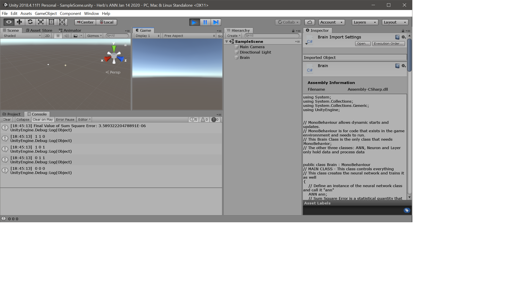

#### From "a Beginner's Guide To Machine Learning with Unity"
#### Herb Guzman
#### UTSA
#### Fall 2019

Aided with the instructor guidance, I created a basic Artificial Neural Network in C#.  

##### Purpose of the project

This is a generic neural network constructed to be use using Unity version 2018.4.11f1 or
newer.  The network consists of four main classes: 'ANN.cs', 'Brain.cs', 'Layer.cs' and 'Neuron.cs.' The Brain class is the main class that runs in Unity and it uses MonoBehavior.  This class calls the ANN class which actually implements the Artificial Neural Network including eight common activation functions. The ANN class the 'Layer' and 'Neuron' classes. The activation functions can be used in the Hidden layers and the Output layer(s).  Only one or two activation functions can be used at a time with the current implementation.  As their names imply, the 'Neuron' class implements a basic perceptron with inputs, a bias and outputs.  The 'Layer' class implements the layers as requested by the 'ANN' class.

The training section of the code in this neural network is the example given in class by
Dr. de Byl; this can be found in the Brain.cs class.  This is for a very simple XOR logic algorithm with two inputs and one output; however,the training section of the code is well commented and shows how one can modify this algorithm to train and test in many other applications.  The default settings for the neural network are two inputs to the input layer, two hidden layers and one output layer.  The default learning rate, alpha is set to 0.7.

#### Example of How to Use

- Open a new project in Unity
- Copy the four C# files in this repo to the Assets folder
- Create an empty game object in the inspector, call it 'Brain'
- Add the Brain script file to the  'Brain' game object in the inspector
- Run the game to simulate an XOR function
- To test a different function, modify the section of the Brain.cs class that has the code for the XOR training and XOR testing.

#### Example Solution

#### References

(de Byl, Penny 2019)
de Byl, Penny. 2019, 'A Beginner's Guide To Machine Learning with Unity' Udemy Online Course, December 2019 <https://www.udemy.com/user/holistic3d>.
